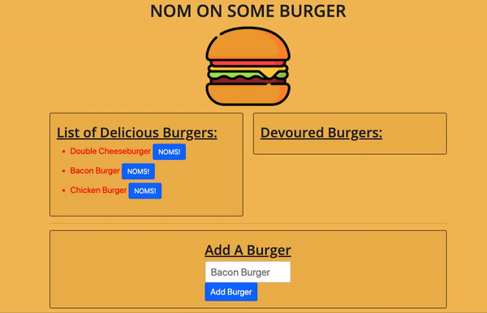

# Nom on Some Burgers

## Description
The purpose of this application is using specific dependencies such as express, express-handlebars, and mySQL to create a burger logger. Users will be able to add any burger that they want to the list and devour them.

## Time of Contents
- [Installation](#installation)
- [Usage](#usage)
- [License](#license)
- [Contribution](#contribution)
- [Tests](#tests)
- [Questions](#questions)

## Installation:
To create this application, you would have to run `npm install` which will provide you a npm dependencies such as node_modules & package-lock.json. However, if users only need to install package.json they can run `npm init -y` on the command-line. 

`mySQL` a database management system

`express` web application framework based on Node.js that provides a ton of features for web and mobile apps.

`express-handlebars` handlebar view engine for Express

`MySQLWorkbench` to deploy my code that is currently listed in `db` folder

`VSCode` my text editor

## Usage

Steps to this application:

    - First clone the rep, if you do not have node_modules make sure to check [Installation](#installation).
    - Go to config/connection.js, add your Password
    - Execute codes from schema and seeds in the db folder to your Workbench.
    - Run node server.js
    - Open localhost from browser then play around with the application.

    (Video provided below)

## License
MIT License

## Contribution
Study Group Peers: Victor Tran, Geoffrey Jiang, Cameron Wright

## Tests

## Questions?
email: victortran415@gmail.com

github: victortran415